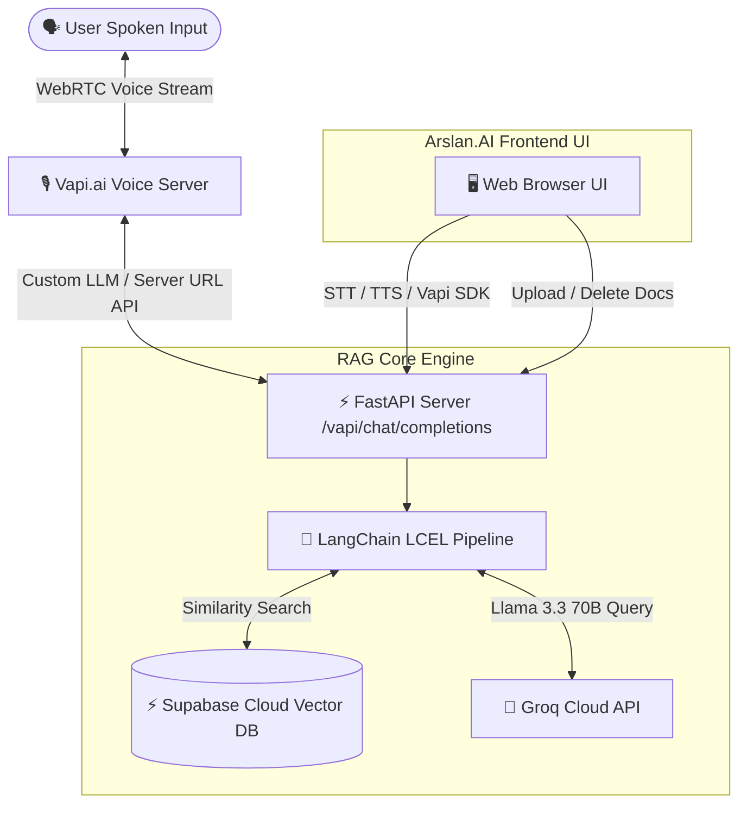

# 🎙️ Real-Time RAG Voice Assistant using VAPI.ai

[](https://fastapi.tiangolo.com/)
[](https://www.langchain.com/)
[](https://vapi.ai)
[](https://supabase.com)
[](https://groq.com)
[](https://vercel.com)

A state-of-the-art **Real-Time Voice AI Assistant** built with **Vapi.ai** for low-latency WebRTC voice conversation, connected to a **LangChain LCEL RAG Pipeline** powered by **Supabase Cloud Vector DB (pgvector)** and **Groq Llama 3.3 70B**. Features the custom **Arslan.AI dark glassmorphism UI** with a dynamic **RAG Document Management Panel** for uploading (`.pdf`, `.docx`, `.txt`) and deleting knowledge files on the fly.

---

## 🏗️ System Architecture



---

## 📋 Vapi.ai Dashboard Setup Guide (Step-by-Step)

Setting up Vapi.ai to use your custom RAG backend takes less than **3 minutes**:

### Step 1: Create Account & Assistant
1. Log in to your [Vapi Dashboard](https://dashboard.vapi.ai).
2. Go to **Assistants** $\rightarrow$ Click **+ Create Assistant**.
3. Select **Blank Template** and name your assistant `Arslan.AI Voice Assistant`.

### Step 2: Configure Custom LLM (Server URL)
1. Under your Assistant settings, navigate to **Model**.
2. Change Provider to **Custom LLM**.
3. Set **Server URL** to your backend URL:
   * **Local / Ngrok**: `https://<your-ngrok-url>/vapi/chat/completions`
   * **Vercel Production**: `https://<your-vercel-app>.vercel.app/vapi/chat/completions`

### Step 3: Get Vapi Public Key & Assistant ID
1. Copy your **Assistant ID** from the assistant header.
2. Go to **Account** $\rightarrow$ **API Keys** $\rightarrow$ Copy your **Public Key**.
3. Paste them into your `.env` file:
   ```env
   VAPI_PUBLIC_KEY=your_vapi_public_key
   VAPI_ASSISTANT_ID=your_vapi_assistant_id
   ```

---

## 🚀 Quickstart & Local Setup

### 1. Clone & Install Dependencies
```bash
cd "Real Time RAG Voice Assistant using VAPI"
pip install -r requirements.txt
```

### 2. Configure Environment Variables
Create a `.env` file from `.env.example`:
```env
GROQ_API_KEY=gsk_your_groq_api_key
SUPABASE_URL=https://your-project.supabase.co
SUPABASE_KEY=your_supabase_anon_key
VAPI_PUBLIC_KEY=your_vapi_public_key
VAPI_ASSISTANT_ID=your_vapi_assistant_id
```

### 3. Ingest Sample Knowledge Documents
```bash
python ingest.py
```

### 4. Run the FastAPI Server
```bash
python server.py
```
Open **`http://localhost:8000`** in your browser to access the Arslan.AI Voice RAG interface!

---

## 📁 RAG Document Management Features

* **Upload Documents**: Click **`📁 + Upload Document`** in the sidebar to add any `.pdf`, `.docx`, or `.txt` file into the vector database.
* **Delete Documents**: Click the **`🗑️`** trash icon next to any file in the **Active Knowledge Files** list to delete it and its vector embeddings instantly from Supabase.
* **Model Selection**: Switch between **Llama 3.3 70B**, **Llama 3.1 8B**, and **Mixtral 8x7B** at any time.

---

## ☁️ Deploying to Vercel

1. Push code to your GitHub repository.
2. Import repository in [Vercel](https://vercel.com).
3. Add Environment Variables on Vercel:
   * `GROQ_API_KEY`
   * `SUPABASE_URL`
   * `SUPABASE_KEY`
   * `VAPI_PUBLIC_KEY`
   * `VAPI_ASSISTANT_ID`
4. Click **Deploy**! Vercel will build your serverless API in < 30 seconds.

---

## 👨‍💻 Author & Credits

* **Developed by**: Arslan
* **GitHub**: [Arslan-Codes097](https://github.com/Arslan-Codes097)
* **LinkedIn**: [Arslan Babar](https://www.linkedin.com/in/arslan-babar-27516731a/)
