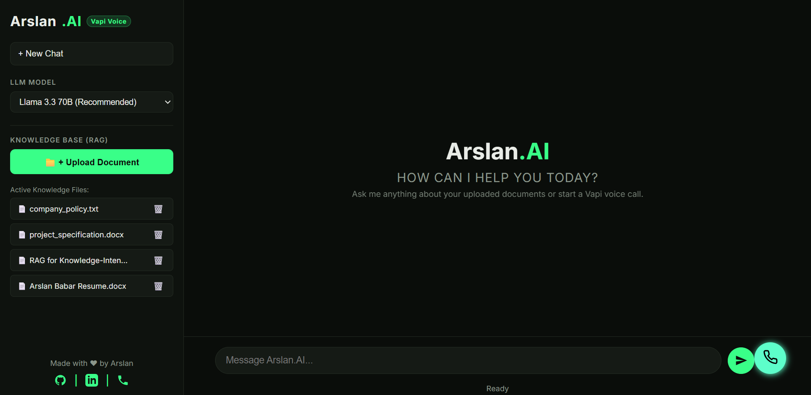
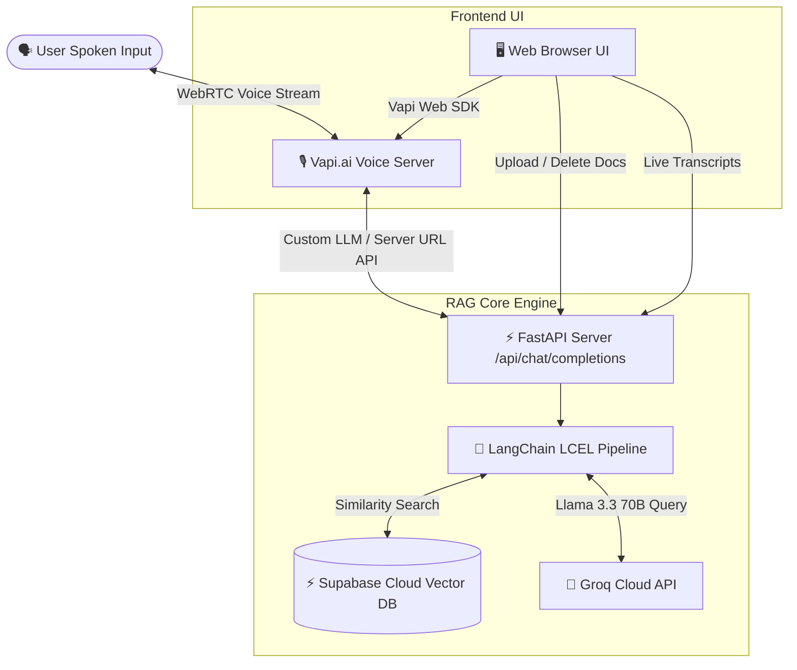

# 🎬 Real-Time RAG Voice Assistant using VAPI.ai

[](https://python.org/)
[](https://fastapi.tiangolo.com/)
[](https://www.langchain.com/)
[](https://vapi.ai)
[](https://supabase.com)
[](https://groq.com)

A state-of-the-art **Real-Time Voice AI Assistant** built with **Vapi.ai** for ultra low-latency WebRTC voice conversation, fully integrated with a **LangChain RAG Pipeline** powered by **Supabase Cloud Vector DB (pgvector)** and **Groq Llama 3.3 70B**. Features a premium dark-mode glassmorphism UI for live text/voice chat and dynamic document management.

---

## 🌐 Live Demo & Media

- **Live Demo Video:** [Watch the Application in Action (Loom)](https://www.loom.com/share/ccdcf8612e87489da3330244ffee6e46)

---

## 📸 Screenshots



---

## ✨ Key Features

- 🎙️ **Real-Time Voice AI:** Lightning-fast WebRTC voice interaction powered by Vapi.ai and Groq.
- 🧠 **Dynamic RAG Pipeline:** Context-aware responses grounded in your uploaded documents using LangChain.
- ⚡ **Server-Sent Events (SSE):** True real-time chunk streaming for immediate voice processing without timeouts.
- 📂 **Live Document Management:** Instantly upload (`.pdf`, `.txt`, `.docx`) or delete knowledge files from the UI.
- 🎨 **Premium UI/UX:** Responsive, dark-mode glassmorphism interface with live voice transcription.
- 🔄 **Cross-Modal Chat:** Seamlessly switch between text messaging and voice calling.

---

## 🛠️ Tech Stack

| Category | Technology | Purpose |
| :--- | :--- | :--- |
| **Frontend UI** | HTML, CSS, JS | Premium custom dark-mode interface and dynamic interactions |
| **Backend API** | FastAPI, Python | Asynchronous RAG processing and SSE streaming endpoints |
| **Voice Engine** | Vapi.ai | Real-time WebRTC audio processing and speech-to-text |
| **LLM Inference** | Groq (Llama 3.3 70B) | Ultra-fast text generation for real-time conversational AI |
| **Vector Database** | Supabase (pgvector) | Serverless vector storage and cosine similarity search |
| **AI Framework** | LangChain | Document chunking, RAG orchestration, and LLM chains |
| **Embeddings** | HuggingFace Inference API | High-quality text embedding generation (BAAI/bge-small-en-v1.5) |

---

## ⚙️ How It Works

1. **Document Ingestion:** Users upload files via the UI. FastAPI chunks the text using LangChain and pushes embeddings to Supabase pgvector.
2. **Voice Interaction:** The user speaks into the Vapi WebRTC widget on the frontend.
3. **Query Interception:** Vapi routes the transcribed text to the local FastAPI backend (via Ngrok) as a Custom LLM request.
4. **RAG Search & Streaming:** FastAPI queries Supabase for context, streams the prompt to Groq, and returns Server-Sent Events (SSE) back to Vapi for instant audio generation.
5. **Live Transcripts:** The frontend listens to Vapi SDK events and appends the live conversation transcripts to the chat UI.

---

## 🏗️ Project Architecture



---

## 📂 Project Structure

```text
Real Time RAG Voice Assistant using VAPI/
├── public/                 # Frontend Assets
│   ├── index.html          # Main UI layout
│   ├── style.css           # Custom glassmorphism design system
│   └── app.js              # Client logic and Vapi Web SDK integration
├── server.py               # FastAPI application and Custom LLM routes
├── rag_pipeline.py         # LangChain RAG logic and Supabase client
├── ingest.py               # Document processing and embedding script
├── requirements.txt        # Python dependencies
├── .env.example            # Environment variables template
└── README.md               # Project documentation
```

---

## 💻 Local Setup & Installation

### Prerequisites
- Python 3.9+
- A [Vapi.ai](https://vapi.ai) account and Assistant
- A [Supabase](https://supabase.com) project with `pgvector` enabled
- [Ngrok](https://ngrok.com/) for local tunnel exposure

### 1. Clone & Install Dependencies
```bash
git clone https://github.com/Arslan-Codes097/Real-Time-RAG-Voice-Assistant-using-VAPI.git
cd "Real Time RAG Voice Assistant using VAPI"
pip install -r requirements.txt
```

### 2. Configure Environment Variables
Create a `.env` file in the root directory:
```env
GROQ_API_KEY=gsk_your_groq_api_key
SUPABASE_URL=https://your-project.supabase.co
SUPABASE_KEY=your_supabase_anon_key
VAPI_PUBLIC_KEY=your_vapi_public_key
VAPI_ASSISTANT_ID=your_vapi_assistant_id
HF_TOKEN=hf_your_huggingface_token
```

### 3. Run the Backend & Tunnel
Start the FastAPI server:
```bash
python server.py
```
In a new terminal, expose your local server to the internet using Ngrok:
```bash
ngrok http 8000
```
*(Configure your Vapi Custom LLM Server URL to point to your new Ngrok address: `https://<your-ngrok-url>.ngrok-free.app/api/chat/completions`)*

### 4. Access the UI
Open **`http://localhost:8000`** in your web browser to upload documents and start talking!

---

## 👤 Author & Credits

* **Developed by**: Arslan
* **GitHub**: [@Arslan-Codes097](https://github.com/Arslan-Codes097)
* **LinkedIn**: [Arslan Babar](https://www.linkedin.com/in/arslan-babar-27516731a/)
